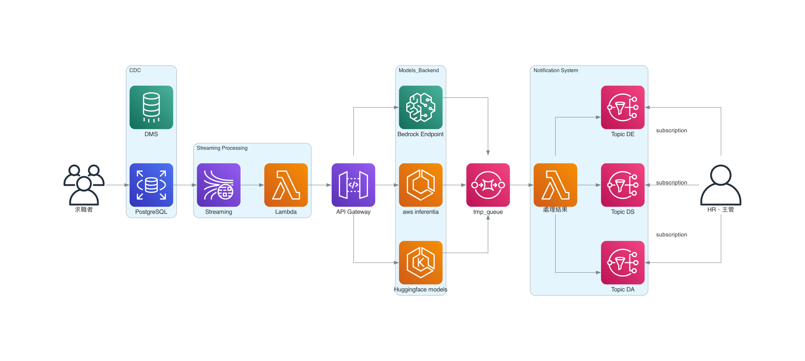

# Welcome to HAIRE!

# 職缺訂閱推薦

 - 建立DB的CDC (chage data capture)機制
 - 將CDC events (Update or Insert)發送至AWS kinesis，並設定lambda與kinesis stream串接
 - 建立API gateway與串接後端
 - 透過lambda調用API gateway，並取得模型推論結果
 - 將結果存入SQS，並觸發lambda將結果導入Topics (這邊可以設定不同的職缺內容)
 - 使用者訂閱相關內容，即可收到結果

